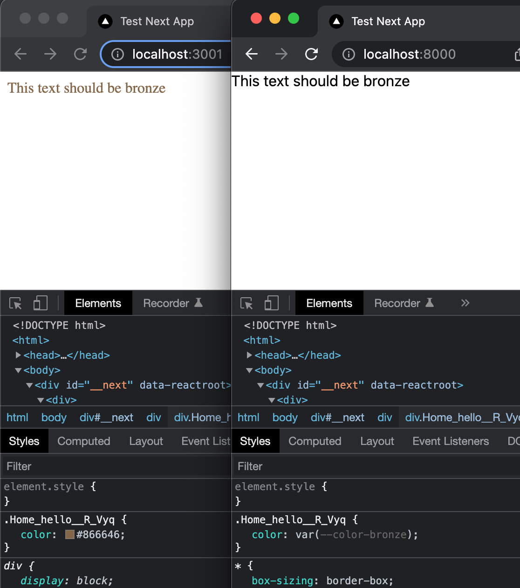

This is a [Next.js](https://nextjs.org/) project bootstrapped with [`create-next-app`](https://github.com/vercel/next.js/tree/canary/packages/create-next-app).

The repository is intended to demo a problem exporting/building Next sites that use CSS variables.

With a suitable PostCSS config file (using the `postcss-custom-properties` plugin and a postcss.config.js file) the CSS variables work fine on running `next run dev` but don't work in the built/exported contents:

